# TASK 1: Setup Development Environment
## Install Rust

- install Rust using [Rustup](https://rustup.rs/) using 
    ````
    curl --proto '=https' --tlsv1.2 -sSf https://sh.rustup.rs | sh
    ````
    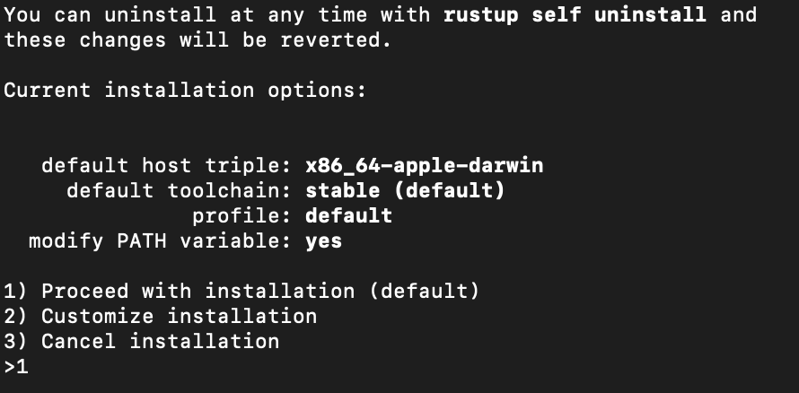
    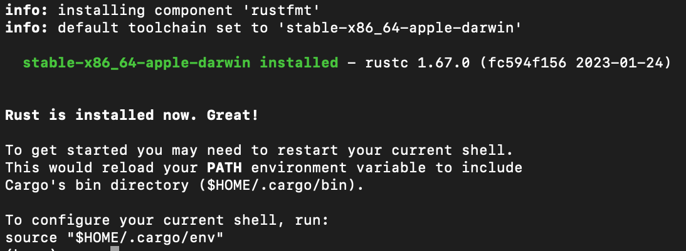

- install Wasm to using this command 
    ````
    rustup target add wasm32-unknown-unknown
    ````

    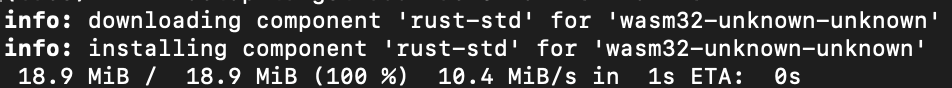

## Install Cargo
- Download [Cargo-concordium v2.7.0 ](https://developer.concordium.software/en/mainnet/net/installation/downloads-testnet.html#cargo-concordium-testnet) rename to cargo-concordium
- move to $HOME/.cargo/bin and make it exucatble using 
    ````
    chmod +x path/to/cargo-concordium 
    ````
    and grant it permission to run in your Security & Privacy settings
- run cargo 
    ````
    concordium --help
    ````
    to make sure is on your path and working correctly

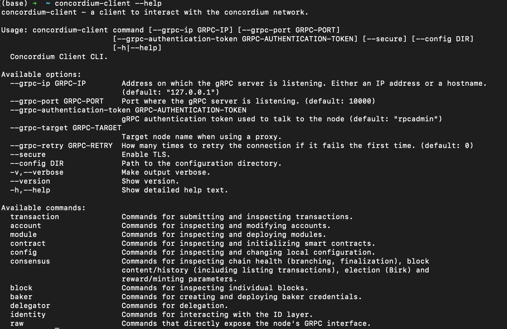

## Install Concordium Client
- [download](https://developer.concordium.software/en/mainnet/net/installation/downloads-testnet.html#concordium-node-and-client-download-testnet) on your OS (i am using Mac) using 
- rename to concordium-client and make sure it executable using 
    ````
    chmod +x concordium-client.pkg
    ````
- make sure it working properly using this command 
    ````
    concordium-client --help
    ````
- try to connect to testnet public node
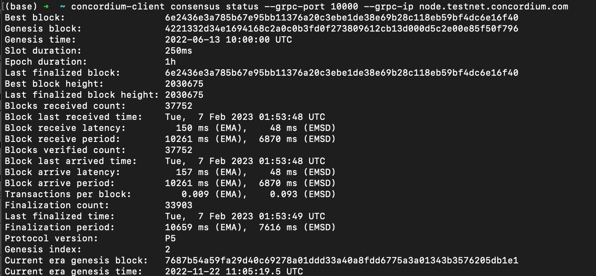


## Install Web Wallet
- install [chrome extension](https://chrome.google.com/webstore/detail/concordium-wallet/mnnkpffndmickbiakofclnpoiajlegmg?hl=en-US)

## Creating Testnet Account
- creating ID using testnet network

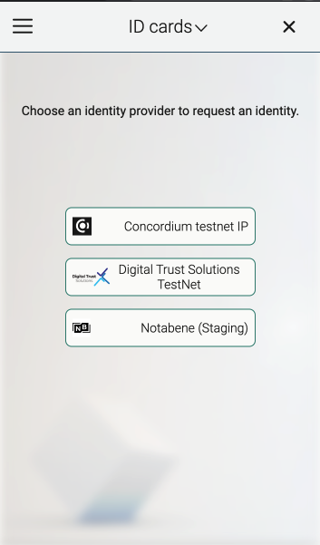
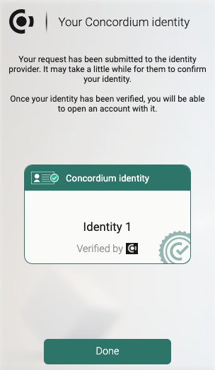

- create an account 

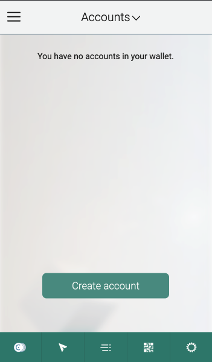
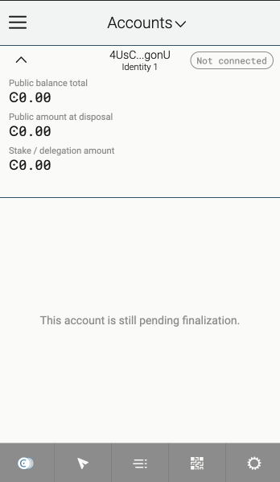

## Faucet CCD
- looking for faucet for 2000 CCD


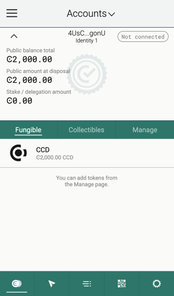


## Export The Key
- export your private key using setting -> export private key
- place your downloaded exported private kety into directory same as concordium-client
- run  
    ````
    concordium-client config account import <YOUR PUBLIC ADDRESS.export> --name <Your-Wallet-Name> 
    ````
    for importing your key into the concordium-client configuration


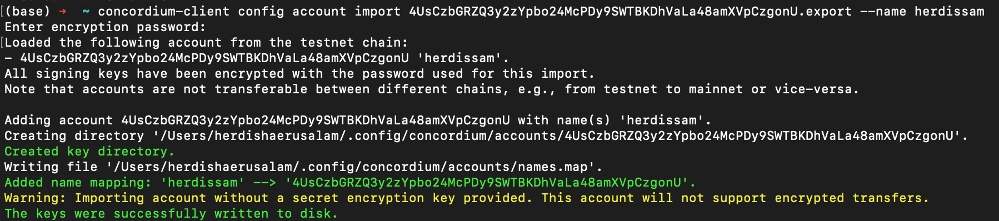

## Mainnet Wallet
- Mainnet Concordium : 4GMMzztjocEkEVNVc2ep8DoNGzzGxQtGPZ8ZKtJKFwz61xih1t
